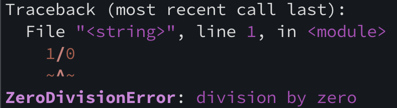
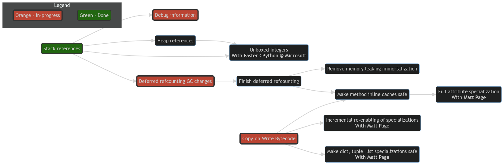

Python release schedule
=======================

# Python is released every October

* **EoL**: 5 year security support window
* **SPEC 0**: 3 year support *(Science libraries)*

# Support table

| **Python** | **Release** | **EoL**  | **SPEC 0**  |
|--------|---------|------|----------|
| 3.8    | 2019    | 2024 | ~~2022~~ |
| 3.9    | 2020    | 2025 | ~~2023~~ |
| 3.10   | 2021    | 2026 | 2024     |
| 3.11   | 2022    | 2027 | 2025     |
| 3.12   | 2023    | 2028 | 2026     |
| 3.13   | 2024    | 2029 | 2027     |

---

Reminder for past versions
==========================

<!-- column_layout: [4, 3] -->

<!-- column: 0 -->

# Python 3.10

* Pattern matching
* Type unions
* Much better errors

# Python 3.11

* Fastest version of Python yet
* Exception groups and notes
* Built-in TOML support
* Annotated tracebacks

# Python 3.12

* Typing Generics
* Native f-strings
* Per-interpreter GIL(\*)
* Partial Perf support

<!-- column: 1 -->

```python
match item:
    case int(x):
        print("Integer", x)
    case _:
        print("Not integer")

try:
    ...
except* TypeError as err:
    ...
except* KeyError as err:
    ...

from numbers import Real

def f[T: Real](x: T) -> T:
    return 2 * x
```

---

<!-- jump_to_middle -->


Python 3.13 is the most forward thinking version of Python ever.
================================================================

---


Major new features
==================

<!-- column_layout: [8, 7] -->

<!-- column: 0 -->


## New REPL

For the first time in 30 years, rewritten in Python!

## Static typing

Several new features, including a bit of new syntax!

<!-- column: 1 -->

## JIT compiler (optional)

Can be enabled when compiling! Only a few percent _slower_ currently.

## Free threading (optional)

Second half of the talk on this one!

<!-- reset_layout -->

# Smaller features


**Typing improvements**: `TypeIs` • Generics defaults • Protocol additions • `ReadOnly`

`@warnings.deprecated` • `process_cpu_count()` • `math.fma()` • `Path.from_uri()`

`python -m random` • 19 modules removed • `2to3` removed • Incremental Garbage collector

iOS support • Perf without frame pointers • 2-year full support window


---

New REPL
========


First thing you see when you start up Python!

# Demo

<!-- pause -->

* Color prompt!
* Multiline input
    * Automatic indentation
    * Up/down arrow keys
* `help`, `exit`, `quit` commands
* **F1**: Help mode
* **F2**: History mode
* **F3**: Paste mode


Disable with `PYTHON_BASIC_REPL` if you like the pain of the old one!

Based on the PyPy REPL.

Much easier for contributors! In Python, and not tied to the interpreter internals.

---

Color Exceptions
================

Like the new REPL, exceptions also have color!



* Control with `FORCE_COLOR` / `NO_COLOR`

---


New error messages
===================

# Mistyped keyword suggests matches

```python
print("hi", endl="")
```
TypeError: print() got an unexpected keyword argument 'endl'. Did you mean 'end'?

<!-- pause -->

# Attributes from global/installed modules covered by local ones

```bash
touch pathlib.py
python -c "import pathlib; pathlib.Path"
```


AttributeError: module 'pathlib' has no attribute 'Path' (consider renaming '/Users/henryschreiner/git/presentations/python313/pathlib.py' since it has the same name as the standard library module named 'pathlib' and the import system gives it precedence)

Note this does not work with `from X import Y` syntax, only `AttributeError`'s.

---

Typing features
===============

# TypeIs

Similar to `TypeGuard`, but narrows out the matched type!

```python
def is_string(x: int | str) -> TypeGuard[str]:
    return isinstance(x, str)

if not is_string(value):
    typing.reveal_type(value)
# Revealed type is 'int | str'

def is_string(x: int | str) -> TypeIs[str]:
    return isinstance(x, str)

if not is_string(value):
    typing.reveal_type(value)
# Revealed type is 'int'
```

---

Typing features
===============

# Generics defaults

```python
@dataclass
class Box[T = int]:
    value: T | None = None
```

This can be used without specifying `T`! What common thing is this useful for?

<!-- pause -->

```python
# Before
def f() -> Generator[int, None, None]:
    yield 42

# Now:
def f() -> Generator[int]:
    yield 42
```

---

Almost a typing feature
=======================

# Deprecated

New decorator for deprecated code that supports type checking too!

```python
@warnings.deprecated("msg")
def function():
   return "Don't use me!"
```

The backport is `typing_extensions.deprecated("msg")`.

# Argparser

There's also a new `deprecated=` parameter for `argparser` methods too!


---

Other typing features
=====================

# New Protocol functions

```python
import typing

class Vector(typing.Protocol):
    x: float
    y: float

print(typing.get_protocol_members(Vector)) # {'x', 'y'}
print(typing.is_protocol(Vector)) # True
```

# ReadOnly dict items

```python
class Movie(TypedDict):
   title: ReadOnly[str]
   year: int
```

---

JIT
===

CPython 3.13 has a disabled-by-default JIT!

* Copy-and-patch implementation using LLVM (compile time dep only)
* Currently a bit slower.
* Proof-of-concept level, needs more routines added.
* Will be enabled when it's ~10% faster (3.14?)


---

Per-interpreter GIL
===================

Added to 3.12, but hard to use, required C-API and was flaky.

3.13 will have a _first party_ PyPI package (the first!) for `interpreters`!

---

Other features
==============

# Cores for a process

`process_cpu_count()`. Easily get the number of CPU cores for the current
process!

# glob.translate

Make a regex from a shell-style glob.

```python
regex = glob.translate("*.py")
```

# math.fma

Avoid intermediate precision loss. PR only took 7 years.

```python
assert math.fma(2,3,4) == 2.0 * 3.0 + 4.0
```

---

Other features (2)
==================

# python -m random

```bash +exec
python3.13 -m random
```

---

Removals
========

# Dead batteries

`aifc`, `audioop`, `cgi`, `cgitb`, `chunk`, `crypt`,
`imghdr`, `mailcap`, `msilib`, `nis`, `nntplib`, `ossaudiodev`, `pipes`,
`sndhdr`, `spwd`, `sunau`, `telnetlib`, `uu` and `xdrlib`.


# End of Python 2

`lib2to3` was removed.

The "porting from Python 2" page was removed as well; Python 2 is officially
history.

# Deprecations

`optparse` and `getopt` are soft deprecated.

Some items in `typing` like `AnyStr` deprecated. Others include `ast.Num` and
the `onerror=` parameter.

---

Developer changes
=================

- Incremental garbage collector
- `locals()` optimized and consistent
- iOS is a supported platform. Android in progress.
- Indents are now stripped from docstrings. Saves space.
- Some deprecated `importlib.resources` functions were undeprecated.
- `python -m venv` now adds a `.gitignore`
- Classes have new `__firstlineno__` and `__static_attributes__` attributes
  populated by the compiler.
- Spawning processes uses `os.posix_spawn` more often, should speed up FreeBSD
  and Solaris.
- Default time resolution is better on Windows.
- `PYTHON_PERF_JIT_SUPPORT` allows integration with Perf without frame pointers
  (3.12 added `PYTHON_PERF_SUPPORT` using frame pointers)

---

Use it today!
=============

# GitHub Actions

```yaml
- uses: actions/setup-python@v4
  with:
    python-version: "3.13"
    allow-prereleases: true
```

# Manylinux

Available on all _supported_ images. (manylinux `2014` and `2_28`,  musllinux `1_1` and `1_2`)

# cibuildwheel

```yaml
CIBW_PRERELEASE_PYTHONS: True
```

---

<!-- jump_to_middle -->

One more thing...
=================


---


```
█▀▀ █▀█ █▀▀ █▀▀ ▄▄ ▀█▀ █░█ █▀█ █▀▀ ▄▀█ █▀▄ █▀▀ █▀▄
█▀░ █▀▄ ██▄ ██▄ ░░ ░█░ █▀█ █▀▄ ██▄ █▀█ █▄▀ ██▄ █▄▀

   █▀█ █▄█ ▀█▀ █░█ █▀█ █▄░█
   █▀▀ ░█░ ░█░ █▀█ █▄█ █░▀█
```


# Free-threaded mode

CPython 3.13 can be compiled **without the GIL**!

---

What is the GIL?
================

# GIL: Global Interpreter Lock

All objects in Python (`PyObject*`) have a **refcount**. Temporaries too.

So all operations in Python are changing refcounts. This is a _very_ hot operation.

Easy solution: lock whenever the Python interpreter is active.

> Issue: Only a single Python operation can run at a time!
>
> Big issue on today's multicore CPUs.

<!-- pause -->

# Compiled operations can release the GIL

Not all is lost: compiled operations (like in NumPy) can release the GIL.

---

Free-threading
==============

# Why is it hard?


It's actually not hard at all. Patches without the GIL started as early as 1.4.

It's hard to make it _fast_. Removing the GIL _and not losing performance_ is hard.


---

How it's done
=============

# Immortal objects

`None` is one of the most common objects. Why refcount it?

Because the "if" for this is in a _really_ hot path!

# Deferred refcounting

Some objects are nearly immortal (modules, functions, code objects); can be treated differently.

# Biased refcounts

Objects have two refcounts now, thread local and shared.

# New allocator
Using Microsoft's thread-safe `mimalloc` instead of homegrown `pymalloc`.


---

The Free-threaded (NOGIL) build
===============================

Called `python3.13t`. Doesn't support Stable ABI (`abi3`).


# Plan

## Phase 1

GIL is opt-out. Python 3.13 and probably 3.14.

## Phase 2

GIL is opt-in. Maybe as early as 3.15 (might be called 3.26)

## Phase 3

Only NOGIL.


> Could be abandoned if the compiled extension community doesn't get on board!

---

Writing for free-threaded
=========================

Example at https://github.com/scikit-build/scikit-build-sample-projects

Compute π by randomly generating values and seeing if they lie inside a circle. Single threaded:

```python
import random

def pi(trials: int) -> float:
    Ncirc = 0

    for _ in range(trials):
        x = random.uniform(-1, 1)
        y = random.uniform(-1, 1)

        if x * x + y * y <= 1:
            Ncirc += 1

    return 4.0 * (Ncirc / trials)
```


---

Writing for free-threaded: Pure Python
======================================

```python
def pi(trials: int) -> float:
    Ncirc = 0
    ran = random.Random()

    for _ in range(trials):
        x = ran.uniform(-1, 1)
        y = ran.uniform(-1, 1)

        if x * x + y * y <= 1:
            Ncirc += 1

    return 4.0 * (Ncirc / trials)

def pi_in_threads(trials: int, threads: int) -> float:
    with ThreadPoolExecutor(max_workers=threads) as executor:
        return statistics.mean(executor.map(pi, [trials // threads] * threads))
```
---

Threading performance of free-threaded
======================================

<!-- new_lines: 3 -->

## Pure Python

| Threads | Time (s) |
|---------|------|
| 1       | 6.48 |
| 2       | 3.28 |
| 4       | 1.74 |

Running with `n=10M`

---

Pybind11: pybcore.cpp
=====================

```cpp
#include <pybind11/pybind11.h>
#include <random>
namespace py = pybind11;
double pi(int n) {
    double sum = 0.0;
    std::random_device r;
    std::default_random_engine e1(r());
    std::uniform_real_distribution<double> uniform_dist(-1, 1);
    for (int i = 0; i < n; i++) {
        double x = uniform_dist(e1);
        double y = uniform_dist(e1);
        if (x * x + y * y <= 1.0) { sum += 1.0; }
    }
    return 4.0 * sum / n;
}
PYBIND11_MODULE(_pybcore, m, py::mod_gil_not_used()) {
    m.def("pi", &pi);
}
```

---

Pybind11: CMakeLists.txt
========================

```cmake
cmake_minimum_required(VERSION 3.15...3.29)

project(FreeComputePi LANGUAGES CXX)

set(CMAKE_CXX_STANDARD 17 CACHE STRING "The C++ standard to use")
set(CMAKE_CXX_STANDARD_REQUIRED ON)
set(CMAKE_CXX_EXTENSIONS OFF)

set(PYBIND11_FINDPYTHON ON)
find_package(pybind11 REQUIRED)
pybind11_add_module(_pybcore MODULE src/freecomputepi/_pybcore.cpp)

install(TARGETS _pybcore DESTINATION freecomputepi)
```

---

Pybind11: pyproject.toml
========================

```toml
[build-system]
requires = ["scikit-build-core", "pybind11"]
build-backend = "scikit_build_core.build"

[project]
name = "freecomputepi"
version = "0.0.1"

[tool.cibuildwheel]
build = "cp313*"
free-threaded-support = true
```
And remember to set `CIBW_PRERELEASE_PYTHONS` when running (or use `--only` locally)


---

Threading performance of free-threaded
======================================

<!-- new_lines: 3 -->

<!-- column_layout: [1, 2] -->

<!-- column: 0 -->

# Pure Python

| Threads | Time (s) |
|---------|------|
| 1       | 6.48 |
| 2       | 3.28 |
| 4       | 1.74 |

Running with `n=10M`

<!-- column: 1 -->

# Pybind11

| Threads | Time (s) |
|---------|------|
| 1       | 2.02 |
| 2       | 1.00 |
| 4       | 0.51 |

Running with `n=100M`

---

Ecosystem
=========

See https://github.com/Quansight-Labs/free-threaded-compatibility

<!-- column_layout: [3, 4] -->

<!-- column: 0 -->

# Projects ready

- cibuildwheel & manylinux
- pybind11
- scikit-build-core, meson-python, setuptools
- pip, uv, build (packaging)

<!-- column: 1 -->

# Only in nightly wheels

https://anaconda.org/scientific-python-nightly-wheels

- numpy (UNIX)
- scipy (UNIX)
- cython

<!-- reset_layout -->

# Beta 3 updates

* `PyMutex` now public, along with `Py_BEGIN_CRITICAL_SECTION`
* Live in manylinux, coming in cibuildwheel soon
* pybind11 likely will move `std::mutex` to `PyMutex` soon

---

Future: 3.14 and beyond
=======================




https://github.com/Quansight-Labs/free-threaded-compatibility/issues/18

Enable more optimizations in free-threaded mode.

---

Summary
=======

Python 3.13 is the most forward thinking version of Python ever!

* New REPL is far easier to contribute to
* New JIT will make future versions faster
* Two forms of parallelism
    * Per-interpreter GIL
    * Free-threaded build

